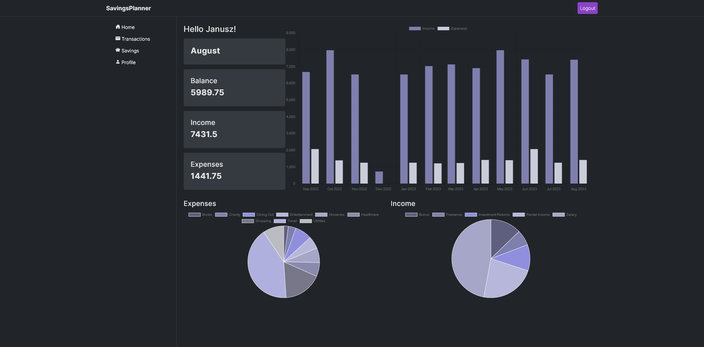
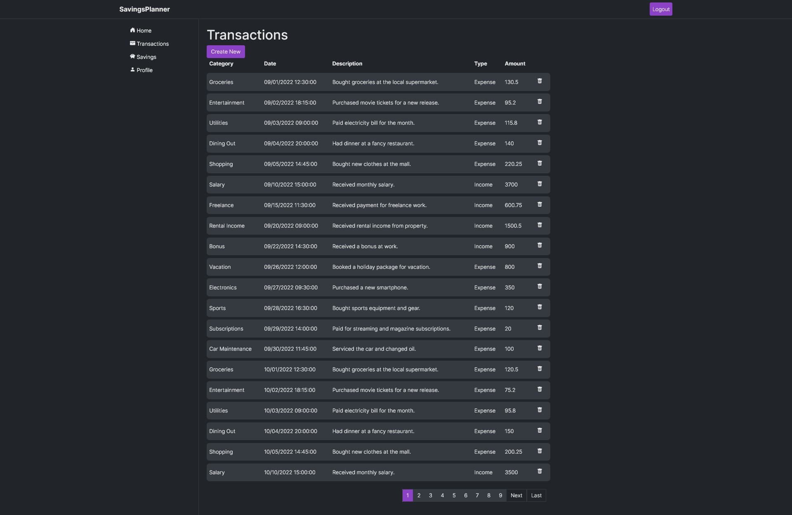
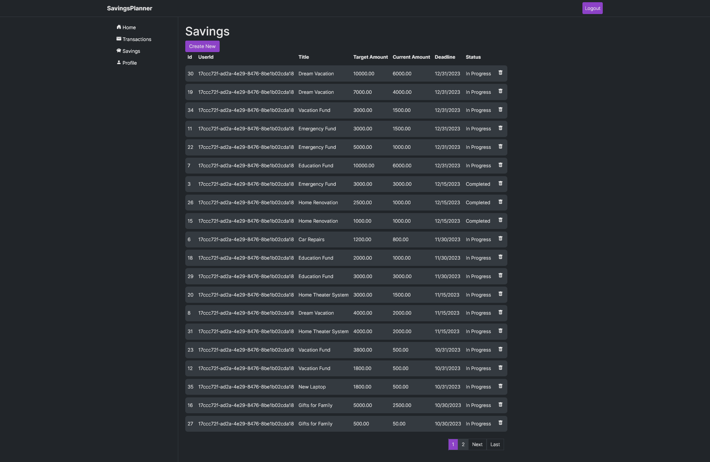

# SavingsPlanner
An application designed to help users manage and track their personal finances.

## Main page
<div style="text-align: center;">
  
</div>

## User page

<div style="text-align: center;">
  
</div>

## Admin panel

<div style="text-align: center;">
  
</div>

## Features
- User registration and authentication: Users can create an account and log in securely to access their personal finance data.
- Admin and user roles: Admins can view all users and their transactions. Users can only view their own transactions.
- Transaction and savings management: Users can add, edit, and delete transactions.
- Transaction visualization: Users can view their transactions in a chart.


## Technologies
- ASP.NET Core MVC
- Entity Framework Core
- Identity Framework
- Bootstrap 5
- JavaScript
- Chart.js
- Sass
- Docker

## Getting Started
To run the application locally, you will need to have Docker installed on your machine. 

To start the application create a `.env` file based on the provided example:
```
CONNECTION_STRING=IntegratedSecurity=true;Pooling=true;Server=db;Database=financetracker;Port=5432;User Id=postgres;Password=postgres;Include Error Detail=true;
PASSWORD=

```
Run the following commands:

```
docker-compose build
```

```
docker-compose up
```
